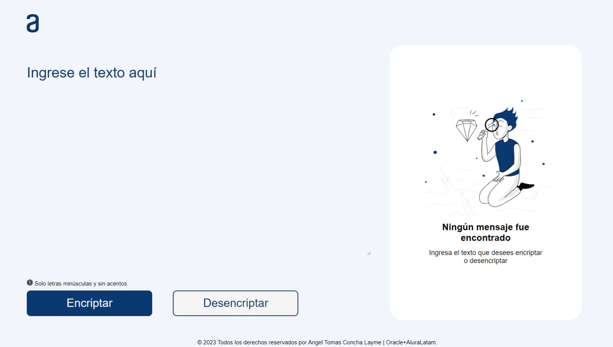

<div align="center"></div>


# Encriptador de texto




<div align="center">
    
    
    
</div>

---

## Descripción
Encriptador de texto desarrollado con JavaScript, HTML y CSS para el challenge del **_Proyecto ONE_** de **Oracle+Alura LATAM**.

---
## Llaves de encriptacion
- La letra "**a**" es convertida a "**ai**".
- La letra "**e**" es convertida a "**enter**".
- La letra "**i**" es convertida a "**imes**".
- La letra "**o**" es convertida a "**ober**"
- La letra "**u**" es convertida a "**ufat**"


---

##  Requisitos

- Debe funcionar solo con letras minúsculas.
- No deben ser utilizados letras con acentos ni caracteres especiales.
- Debe ser posible convertir una palabra para la versión encriptada también devolver una palabra encriptada para su versión original.

```
Por ejemplo:
"gato" => "gaitober"
gaitober" => "gato"
```

- La página debe tener campos para inserción del texto que será encriptado o desencriptado, y el usuario debe poder escoger entre as dos opciones.
- El resultado debe ser mostrado en la pantalla.

---

## Autor 
- Angel Tomas Concha Layme <br>
[](https://github.com/angel-concha-layme) 
